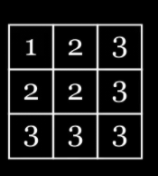

# 첫 시도
- n이 천만 범위란걸 좀 일찍 볼걸..(시간초과)

```java
public class Solution {

    public int[] solution(int n, long left, long right) {
        int[] answer = new int[(int) (right-left+1)];

        int index = 0;
        for (int row = 1; row <= n; row++) {
            int number = row;
            for (int col = 1; col <= n; col++) {
                if (number < col) {
                    number++;
                }
                if(left <= ((long) (row - 1) * n) + (col-1) && ((long) (row - 1) * n) + (col-1) <= right) {
                    answer[index++] = number;
                }
            }
        }

        return answer;
    }
}
```

## 풀이


- Math(행,열) 을 통해 원소가 들어가는 것을 확인할 수 있음
- 2차원을 1차원 처럼 순회할 때, 3x3인 경우 9만큼 돌 수 있는데, 
  `행: i/n, 열: i%n` 을 통해, 2차원의 좌표를 구할 수 있음
- 이런식을 하는 이유는, 문제에서 제공해주는 left, right가 1차원 배열일 때의 좌표를 준 것이고,
  - 우리는 2차원 좌표를 통해, 요소를 계산 할 수 있기 때문이다.

```java
0 1 2 3 
4 5 6 7
8 9 10 11
```
> row 0 4 8    
> col은 index가 더 해지는 형태
  
```java
public class Solution {
  public int[] solution(int n, long left, long right) {
    int[] answer = new int[(int) (right - left + 1)];

    int index = 0;

    // 2차원 배열(n*n)의 좌표를 1차원 배열의 좌표로 만든 게 left와 right
    // 주어진 1차원 배열의 좌표로 순회 하면서 2차원 좌표를 구하면 됨
    while(left <= right){

      // 2차원 배열 -> 1차원 배열 = (배열길이 * ROW) + COL;
      int row =  (int) (left / n);
      int col =  (int) (left % n);

      // 문제 그림 조건 처럼, 행이 열보다 작을 경우는 열로 대체 그 외 값은 열
      // left, right는 0부터 시작하는 좌표이므로, 우리가 원하는 값으로 바꿔주기 위해 +1을 해줌
      answer[index] = Math.max(row, col) + 1;

      index++;
      left++;
    }

    return answer;
  }
}
```
